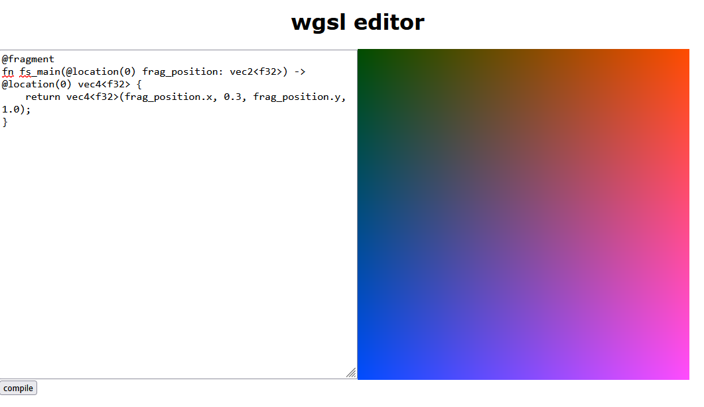

# wgsl shader editor

A simple shader editor with wgsl
Inspired by the great [ShaderEditor](https://github.com/markusfisch/ShaderEditor)



## To run

Install [dioxus](https://dioxuslabs.com/learn/0.7/getting_started/)

Run the following command to start

```bash
dx serve --desktop
```

Alternatively can run with e.g. --web or --android for those platforms
